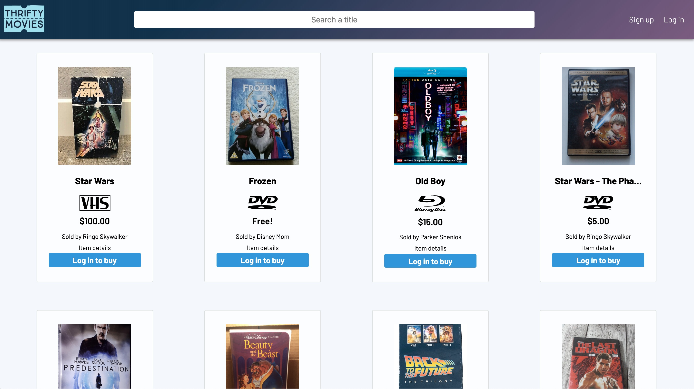
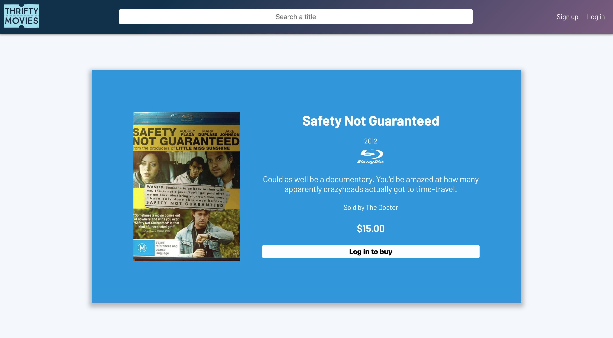
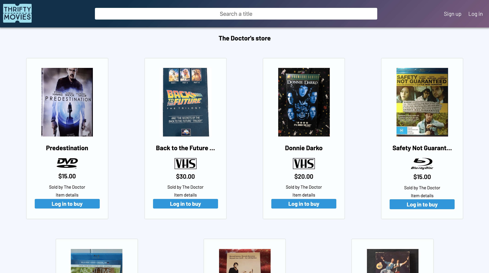
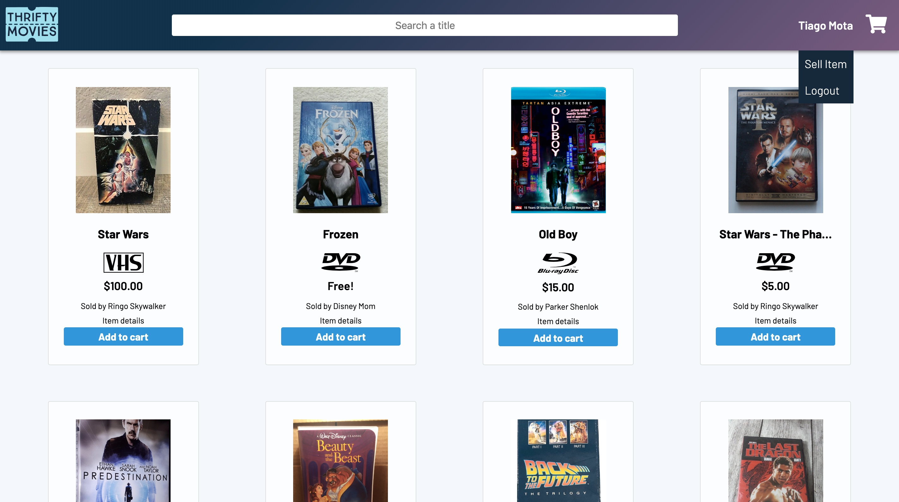
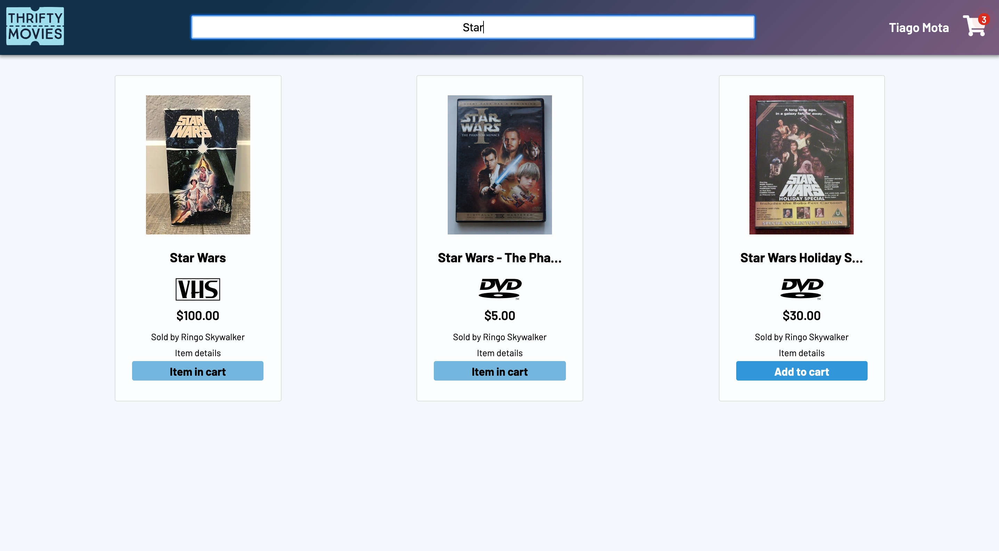
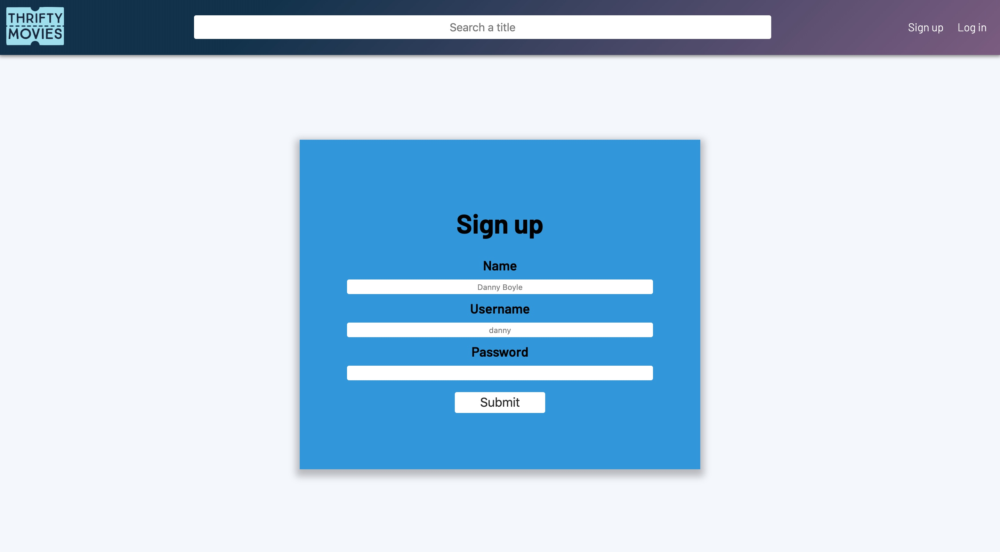
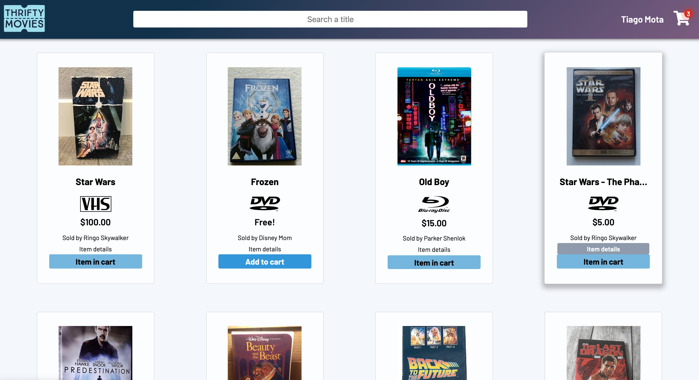
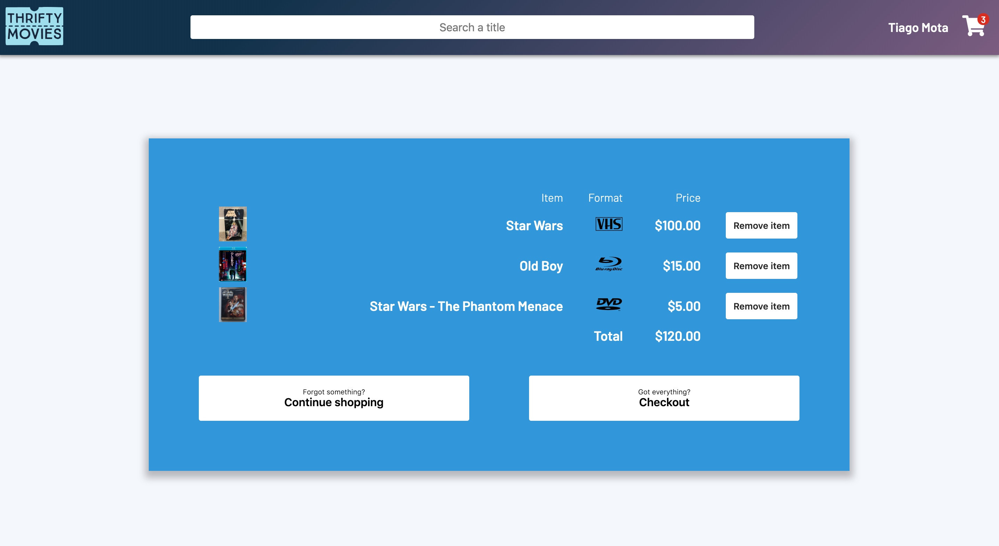

# **Thrifty Movies**

## **Concordia Front-End Development Bootcamps - Final Project**

Simple marketplace with an 'Used Movies' theme.

### **Features**

- Dynamic button show `Login`, `Add to cart` or `Item in cart` depending on the state
- Live search filters the result
- Search IMDb for a movie whose title is already filled when adding an item to sell
- Random name/username placeholder on Sign Up form show different filmmaker each time
- Show item details
- Show all items sold by an user

### **Language/libraries used**

- Javascript
- React
- React-Redux
- React-Router
- Express
- Styled Components
- Multer

### **Video Run-through**

https://youtu.be/xmuVqtxwowA

### **Screenshots**

